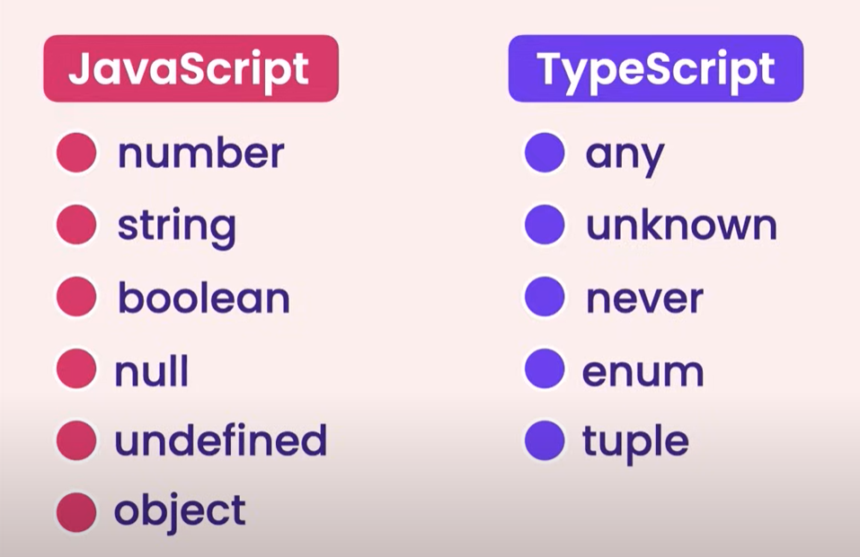

# TypeScript-Practise
This repo is created to learn TypeScript.

# TypeScript Vs Javascript
| TypeScript | JavaScript |
|  ----------- | ----------- |
| Superset of JS. Which means TS has all the JS features with few other extra features | Every JS file is a valid TS file |
| Statically typed programming language like Java, C++ and C# | Dynamically typed programming langauage like Python, Ruby |
| Ideal for medium and large scale projects with team. It's easy to find bugs and refactor. | Ideal for small scale projects because of the flexibility |
| By default TS uses the older version of JS (ES5). So it will use 'var' keyword in JS instead of 'let' when compiling to JS file. But we configure to use newer version| Uses updated versions |

# Install Typescript globally to access from any folder
`npm i -g typescript`

# Check the typescript version
`tsc -v`

# Compile Typescript file
`tsc index.ts`

This will create a index.js file.Current browsers can't directly compile the TypeScript. So we need to compiple into to javascript first.

# TypeScript Compiler Configuration 
`tsc --init`

1. It will create the tsconfig.json file. 
2. Do the neccessary changes 
3. Run 'tsc' command 

# Compile all the TS files
`tsc`

# TypeScript basic types

1. number
2. string
3. boolean
4. any (If we use this, this is similar to js. So no point of using ts)
5. array 
6. tuple
7. enum (Best practise to use const key word with enum to generate more optimised code by the compiler)

# To execute the javascript code 

node dist/index.js